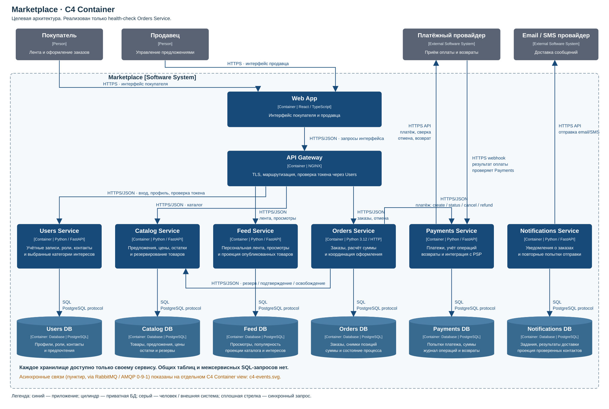
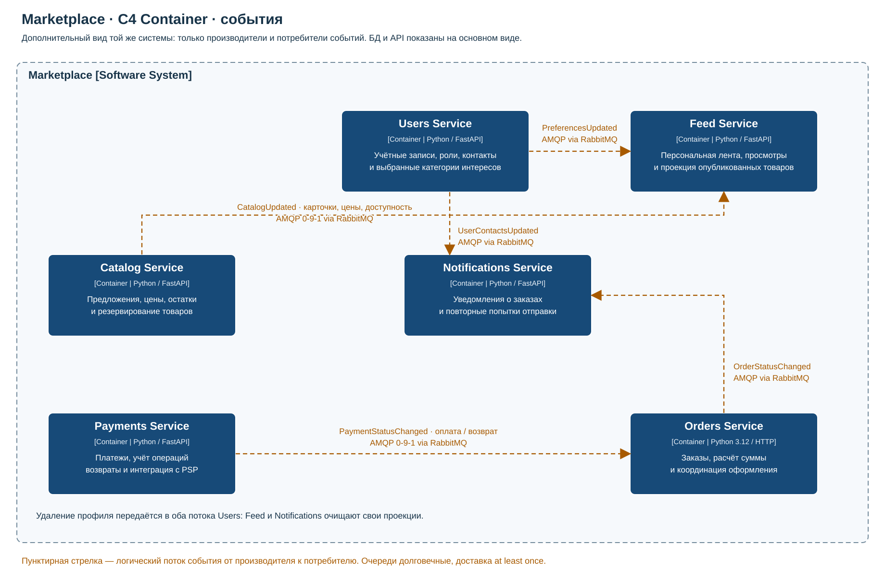

# arch_HW1 — архитектура маркетплейса

Целевая платформа позволяет продавцам управлять товарами, а покупателям получать персональную ленту и оформлять заказы. Архитектура описана на уровне C4 Container. Реализован только каркас **Orders Service** с `GET /health`; бизнес-логики, БД и интеграций в коде нет.

## C4 Container





Два вида показывают одну целевую систему. Сплошные стрелки — синхронные запросы, пунктирные — события через RabbitMQ. Покупатель, продавец и внешние провайдеры находятся за границей Marketplace. Контейнер C4 обозначает приложение или хранилище данных, а не обязательно Docker-контейнер.

[Основная диаграмма отдельно](docs/c4-container.svg) · [Потоки событий](docs/c4-events.svg) · [Исходник PlantUML](docs/c4-container.puml).

## Домены и владение данными

В выбранном варианте каждому домену соответствует отдельный сервис. Границы проведены по ответственности, а не по таблицам.

| Домен / сервис | Ответственность | Собственные данные | Локальные копии для чтения |
|---|---|---|---|
| Пользователи / **Users** | Регистрация, аутентификация, роли покупателя и продавца, профили и предпочтения | Учётные записи, роли, проверенные контакты, категории интересов | Нет |
| Каталог / **Catalog** | Предложения продавцов, публикация, цены, остатки и резервирование | Товары, предложения с `sellerId`, цены, остатки, резервы | Идентификатор продавца без копии профиля |
| Лента / **Feed** | Персональная выдача, просмотры и популярность | История просмотров и показатели популярности | Опубликованный каталог и категории интересов из Users |
| Заказы / **Orders** | Оформление, расчёт стоимости, состояние заказа и координация оплаты | Заказы, снимки позиций и цен, итоговая сумма, идентификаторы резервов и платежей, состояние процесса | Снимки Catalog и результат Payments |
| Платежи / **Payments** | Создание платежей, учёт операций, возвраты и интеграция с PSP | Платёжные попытки, суммы и валюта, идентификаторы PSP, журнал оплат и возвратов | `orderId`, `userId` и зафиксированная сумма из Orders |
| Уведомления / **Notifications** | Отправка сообщений о статусах заказов и повторные попытки | Шаблоны, задания и результаты доставки | Проверенные контакты из Users |

У каждого сервиса **отдельная PostgreSQL БД и отдельные права доступа**. Другие сервисы не читают её таблицы и не выполняют межсервисные SQL JOIN. Общей БД между сервисами нет. Локальная проекция может отставать от источника и не даёт права менять исходные данные: актуальной ценой владеет Catalog, контактом — Users.

Web App на React/TypeScript предоставляет интерфейс покупателя и продавца. API Gateway на NGINX отвечает за TLS, маршрутизацию и проверку токена через Users. Доменные сервисы проверяют права на конкретный заказ или предложение; Gateway не хранит бизнес-данные.

## Персонализация

Feed сначала показывает доступные опубликованные товары из выбранных категорий и категорий недавних просмотров, затем популярные товары. Для анонимного пользователя или отсутствия истории используется популярная выдача. При равном приоритете сортировка стабильна по идентификатору товара.

Просмотры поступают через API Feed, предпочтения — из Users, карточки товаров — из Catalog. Для этого кейса достаточно правил и PostgreSQL; отдельный ML-сервис не требуется. При оформлении Orders проверяет актуальные цены и наличие в Catalog, поскольку лента использует проекцию.

## Взаимодействия

| Откуда → куда | Назначение | Способ |
|---|---|---|
| Покупатель / продавец → Web App | Интерфейс | HTTPS, браузер |
| Web App → Gateway | Запросы интерфейса | Синхронно, HTTPS/JSON |
| Gateway → Users | Вход, профиль, проверка токена | Синхронно, HTTPS/JSON |
| Gateway → Catalog | Чтение и управление предложениями | Синхронно, HTTPS/JSON |
| Gateway → Feed | Лента и просмотры | Синхронно, HTTPS/JSON |
| Gateway → Orders | Оформление, состояние и отмена | Синхронно, HTTPS/JSON |
| Orders → Catalog | Резерв, подтверждение, освобождение | Синхронно, HTTPS/JSON |
| Orders → Payments | Создание, проверка, отмена платежа, возврат | Синхронно, HTTPS/JSON |
| Payments → PSP | Платежи и возвраты | Синхронно, HTTPS API |
| PSP → Payments | Подтверждение результата | HTTPS webhook с проверкой подлинности в Payments |
| Catalog → Feed | `CatalogUpdated` | Асинхронно, RabbitMQ / AMQP 0-9-1 |
| Users → Feed | `PreferencesUpdated`, удаление профиля | Асинхронно, RabbitMQ / AMQP 0-9-1 |
| Users → Notifications | `UserContactsUpdated`, удаление профиля | Асинхронно, RabbitMQ / AMQP 0-9-1 |
| Payments → Orders | `PaymentStatusChanged` | Асинхронно, RabbitMQ / AMQP 0-9-1 |
| Orders → Notifications | `OrderStatusChanged` | Асинхронно, RabbitMQ / AMQP 0-9-1 |
| Notifications → email/SMS провайдер | Доставка сообщения | Синхронно, HTTPS API |
| Каждый сервис → своя БД | Чтение и запись состояния | SQL / PostgreSQL protocol |

Синхронный ответ нужен для резерва и ссылки оплаты. Обновление проекций и уведомления допускают задержку и не должны увеличивать время пользовательского запроса. Webhook приходит на отдельный HTTPS endpoint Payments; проверку подписи, суммы, валюты и идентификатора выполняет Payments. Детали сетевого размещения не входят в Container-диаграмму.

## Оформление и согласованность

1. Orders сохраняет процесс оформления с идентификатором заказа и ключом идемпотентности, затем получает резерв и актуальные цены у Catalog.
2. Orders фиксирует снимки позиций: товар, предложение, продавец, название, цена и количество. Сумма заказа — сумма `цена × количество`; деньги хранятся целыми минимальными единицами одной валюты. Доставка, скидки, налоги и выплаты продавцам вне границ этой модели.
3. Orders сохраняет `PendingPayment` и запрашивает платёж у Payments. Payments создаёт попытку в PSP на зафиксированную сумму и возвращает ссылку оплаты. Покупатель вводит реквизиты на стороне PSP.
4. Payments получает проверенный webhook, записывает финансовую операцию и публикует `PaymentStatusChanged`. Возвращение браузера само по себе не подтверждает оплату.
5. После успешной оплаты Orders подтверждает резерв в Catalog и только затем устанавливает `Paid`. При отказе освобождает резерв. При отмене или невозможности исполнить оплаченный заказ запускает отмену платежа либо возврат.
6. Orders публикует `OrderStatusChanged`; Notifications отправляет сообщение по контакту из своей проекции. Ошибка уведомления не отменяет заказ.

Общей транзакции между сервисами нет. Orders координирует процесс с компенсациями (**saga**); незавершённые действия и компенсации сохраняются в его БД и повторяются после сбоев. Команды Catalog, Payments и PSP используют ключи идемпотентности. Таймаут платежа означает неизвестный результат: повторяется тот же ключ или выполняется сверка с PSP. Поздняя успешная оплата отменённого заказа требует возврата, а не повторного перевода в `Paid`. Состояние возврата принадлежит Payments.

Для событий предусмотрен **transactional outbox**: изменение состояния и событие записываются одной локальной транзакцией. Доставка — **at least once**, получатели дедуплицируют `eventId` и учитывают версию агрегата. Ошибки повторяются с ограниченным backoff, исчерпанные попытки направляются в DLQ. События Orders содержат `userId`, а не контактные данные; контакты поступают в Notifications из отдельного потока Users.

Эти механизмы описаны как архитектурные решения и не реализованы в текущем каркасе.

## Альтернативы и выбранный вариант

| Вариант | Разбиение | Плюсы | Минусы / trade-offs |
|---|---|---|---|
| **A. Модульный монолит** | Одно backend-приложение, шесть внутренних модулей, одна БД с владением таблицами по модулям | Простой запуск и выпуск, локальные транзакции, меньше инфраструктуры | Всё приложение масштабируется и выпускается вместе; тяжёлая лента конкурирует с оформлением; сбой платёжной интеграции может затронуть общий процесс; владение таблицами обеспечивается правилами кода |
| **B. Доменные сервисы — выбран** | Шесть независимых приложений с приватными БД, API и событиями | Независимые изменения и масштабирование Feed; отдельный процесс Payments; явное владение данными, изоляция от сбоев доставки уведомлений | Больше приложений и инфраструктуры; задержки проекций, сетевые отказы, saga, компенсации и повторная доставка; отказ Catalog или Payments мешает оформлению |

Выбран **вариант B**, поскольку каталог, персональная выдача, платёжная интеграция и уведомления имеют разные ответственность и режимы работы. Заказы и координация оформления остаются вместе в Orders; отдельный сервис на каждую таблицу не создаётся.

Выбор предполагает дальнейший рост платформы и независимые изменения доменов. Масштаб и SLA в условии не заданы: для небольшого MVP монолит A был бы дешевле. На текущем этапе цена реализации ограничена одним каркасом, как требует задание.

PostgreSQL выбран для транзакционных данных и простой проекции, RabbitMQ — для долговечных сообщений и повторов, HTTPS API — для немедленных ответов. Для будущих API предполагается Python/FastAPI; текущему `/health` достаточно стандартной библиотеки Python 3.12.

## Запуск и проверка

Нужен запущенный Docker Engine / Docker Desktop с Compose. Из корня репозитория:

```bash
cd arch_HW1
docker compose up --build -d
docker compose ps
curl -i http://localhost:8080/health
```

Ожидается `200 OK`, `Content-Type: application/json` и тело:

```json
{"status": "ok", "service": "orders-service"}
```

Dockerfile содержит `HEALTHCHECK`; контейнер должен получить статус `healthy`. Процесс работает от пользователя `app`. `/health` проверяет доступность HTTP-процесса; другие GET-пути, включая `/orders`, возвращают `404`.

Логи и остановка из папки `arch_HW1`:

```bash
docker compose logs orders-service
docker compose down
```

Если порт 8080 занят, выполните из `arch_HW1`:

```bash
HOST_PORT=18080 docker compose up --build -d
curl -i http://localhost:18080/health
```

Контрактные тесты (Python 3.12), также из `arch_HW1`:

```bash
python3 -m unittest discover -s service/tests -v
```

Тесты проверяют `200`, JSON и тип содержимого `/health`, а также `404` для остальных маршрутов. GitHub Actions выполняет тесты, сборку образа и HTTP-проверку запущенного контейнера. В Compose запускается только Orders Service: остальные контейнеры показаны как целевая архитектура.

Для обновления диаграмм из `arch_HW1`: `python3 scripts/render_diagram.py`. Скрипт использует только стандартную библиотеку и формирует SVG и PlantUML из одной модели.
